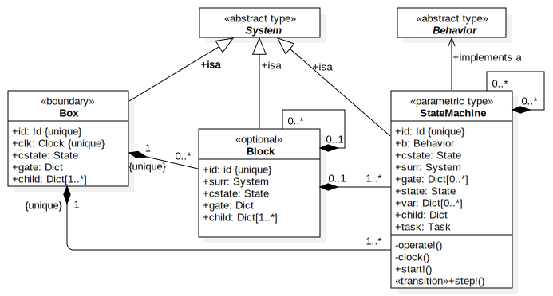

# A framework for state machines

State machines can be used to describe or implement discrete event systems. `Julia` with its [multiple dispatch system](https://docs.julialang.org/en/v1/manual/methods/#Methods-1) is particularly practical in this regard. `StateMachines.jl` provides a framework to allow a straightforward implementation of interacting state machines.

## System box

In order to avoid confusion with the fuzzy meaning of the word "system", we declare
[`System`](@ref) as an abstract type used for different things and take a [`Box`](@ref)
as the outermost boundary of the system we interact with. A box contains blocks and
processes. It has a clock, a composite state and one or more input/output channels.

## Block

A [`Block`](@ref) is optional and a container of other blocks and processes and resides
inside a `Box` or another `Block`. It can hide deeper and more intricate processes
behind a simple interface. It has a composite state and one or more input/output channels.

In a structural view it contains several entities like servers in a server
farm or facilities and medical staff in an emergency room. From a behavioral standpoint
it represents a composite state like `Down()` or `Alerted()` or a domain event, consisting of several structural events like maintenance steps or emergency procedures.   

## State machine

A [`StateMachine`](@ref) is the basic operating unit of our framework. It implements the [`Behavior`](@ref) and the actions of the system, reacts to events and changes system states. A state machine has a composite state and represents a behavior through transitions between states and may contain sub state machines.

### State

### Event

### Transition

### Action
